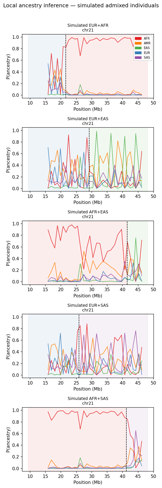
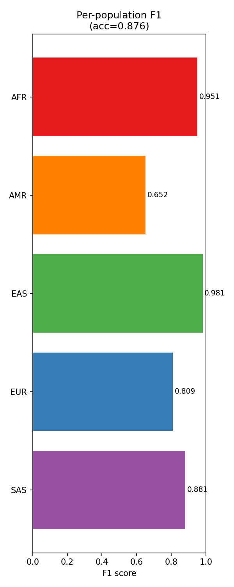
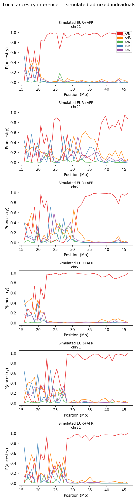

# Deep Learning in Genomics Final Project: Ancestry classifier on 1kG
*Austin Szatrowski*

**Task:** Given a window of SNPs, predict the source population label. As an extension, simulate admixed individuals (two ancestral segments fused together) and try to identify both source populations and the crossover point.

**Data:**
1000Genomes. Public FTP at `ftp.1000genomes.ebi.ac.uk`. Phase 3 release: ~2,504 individuals, 26 populations, 5 super-populations (AFR/AMR/EAS/EUR/SAS). Phased VCFs per chromosome. 

**Model architecture:**

Both models are instances of `AncestryClassifier` ([scripts/model.py](scripts/model.py)), a 1D CNN that takes a window of dosage-encoded SNPs (shape `[1, window_size]`) and outputs logits over the 5 superpopulation classes (AFR/AMR/EAS/EUR/SAS). The backbone is a stack of Conv1d → BatchNorm1d → ReLU → MaxPool1d(4) blocks, followed by a two-layer MLP classifier (256 hidden units + dropout). Two architectures were selected as the best undilated and best dilated configurations from a Bayesian W&B hyperparameter sweep over 20 trials, all using 20,000-SNP windows.

**Model A (undilated):** Three conv blocks with channels `[32, 64, 128]`, kernel sizes `[7, 5, 3]`, and dilation rates `[1, 1, 1]`. With no dilation, each conv layer sees only its immediate neighborhood; three MaxPool(4) layers compress the sequence 64× before the classifier. Dropout = 0.34. Test window accuracy: **87.6%**.

**Model B (dilated):** Three conv blocks with channels `[64, 128, 256]`, kernel sizes `[7, 7, 7]`, and exponentially increasing dilation rates `[1, 8, 32]`. Dilation inserts gaps between kernel weights so each filter covers a wider span of the input without adding parameters — the effective receptive field reaches ~6,250 SNPs, roughly 3× larger than Model A's. This allows the network to capture longer-range linkage-disequilibrium patterns. Dropout = 0.103. Test window accuracy: **86.4%**.

**Model perofrmance:**
_Superpopulation classification (20kb windows):_

_Simulated admixture:_

**Pipeline:**

The preprocessing pipeline is managed by Snakemake ([snakefile](snakefile)). Rules run in dependency order; training and evaluation are handled separately in the Colab notebook described below.

| Rule | Description |
|---|---|
| `download_1kg` | Downloads phased, chromosome-specific VCF files from the 1000 Genomes public FTP server via wget. |
| `download_sample_pop_sheet` | Downloads the 1kG Phase 3 sample/population assignment sheet (used as classifier labels). |
| `extract_biallelic_test_SNPs` | Filters raw VCFs to biallelic, segregating SNPs using bcftools, discarding multi-allelic sites and fixed variants. |
| `make_plink_fileset` | Converts chromosome-specific filtered VCFs to plink2 binary format (.pgen/.pvar/.psam). |
| `compute_pca` | Runs PCA on each chromosome's plink fileset via plink2, producing per-chromosome eigenvectors and eigenvalues. |
| `plot_pca` | Plots the first two PCs colored by superpopulation using ggplot2, labeling statistical outliers with ggrepel. |
| `export_genotypes` | MAF-filters the plink fileset and exports an additive dosage matrix (.raw) plus a matching variant info file (.pvar). |
| `prepare_training_data` | Reads per-chromosome dosage matrices and population labels, performs an individual-stratified 70/15/15 train/val/test split, and writes a single compressed HDF5 dataset (`data/dataset.h5`). |
| `simulate_admixed` | Creates synthetic 2-way admixed test individuals by splicing chromosomal tracts from two reference individuals at a random crossover point (20th–80th SNP percentile). Covers five ancestry-pair combinations: EUR+AFR, EUR+EAS, AFR+EAS, EUR+SAS, AFR+SAS. Writes `data/admixed_test.h5` with per-SNP ground-truth tract labels for LAI evaluation. |

**Notebook — [notebooks/colab_train.ipynb](notebooks/colab_train.ipynb)**

Handles model training and evaluation; designed to run on Google Colab (GPU) rather than locally. After the Snakemake pipeline produces `data/dataset.h5` and `data/admixed_test.h5`, those files are uploaded to Google Drive, from which the notebook reads them. It: (1) mounts Drive and clones the repo; (2) runs a 20-trial Bayesian W&B sweep over window sizes, learning rates, dropout rates, and a range of undilated and dilated `conv_arch` strings to identify the best configurations; (3) retrains Model A (best undilated) and Model B (best dilated) for 25 epochs using `scripts/train.py`; and (4) evaluates both checkpoints with `scripts/evaluate.py`, saving confusion matrices, per-population F1 bar plots, and LAI karyograms back to Drive.